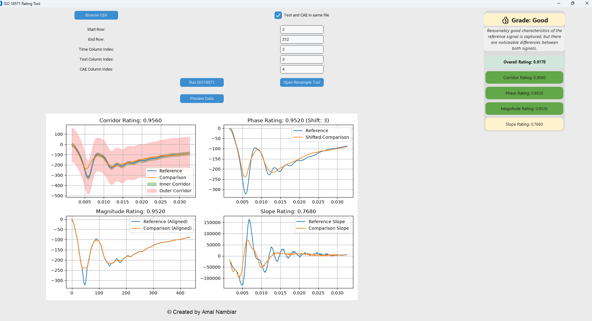
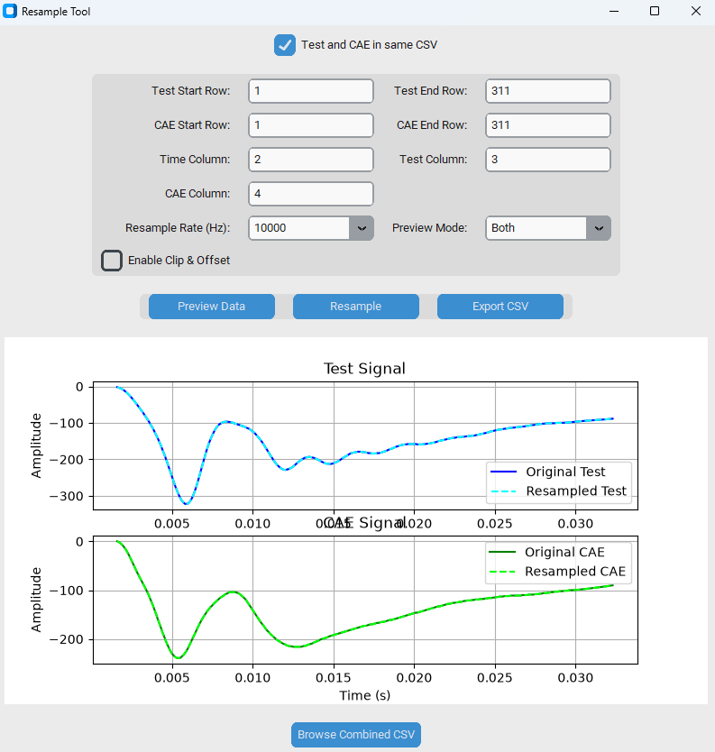

# ISO-18571-Calculator
This is an interactive ISO score calculator created by me. Users can provide the CAE and Test data in GUI to calculate individual and total iso score with graphs. 





# ISO 18571 Rating Tool

A Python-based GUI application for evaluating correlation between **Test** and **CAE** signals using the **ISO 18571 Objective Rating Method**.

The application provides an easy-to-use interface for:

- Loading Test and CAE CSV data
- Automatic data range detection
- Signal preview and validation
- ISO 18571 correlation analysis
- Visualization of all rating components
- Signal resampling and synchronization
- CSV export of resampled data

---

## Features

### ISO 18571 Evaluation

The application calculates:

- Overall Rating
- Corridor Rating
- Phase Rating
- Magnitude Rating
- Slope Rating

and automatically assigns a quality grade:

| Grade | Rating |
|---------|---------|
| 🌟 Excellent | > 0.94 |
| 👍 Good | > 0.80 |
| ⚠️ Fair | > 0.58 |
| ❌ Poor | ≤ 0.58 |

---

### Integrated Resample Tool

The resample utility is integrated directly into the application and opens in a separate GUI window.

Features include:

- Single-file mode
- Separate Test / CAE file mode
- Signal clipping
- Offset correction
- Resampling at:
  - 500 Hz
  - 1000 Hz
  - 2000 Hz
  - 5000 Hz
  - 10000 Hz
- Preview before export
- Export synchronized CSV data

---

### Signal Visualization

The application automatically generates:

#### Corridor Rating Plot
- Inner corridor
- Outer corridor
- Reference signal
- Comparison signal

#### Phase Rating Plot
- Signal alignment visualization
- Phase shift detection

#### Magnitude Rating Plot
- Magnitude comparison

#### Slope Rating Plot
- Derivative comparison

---

## Supported Input Format

CSV files containing:

```text
Time | Test Signal | CAE Signal
```

Example:

```csv
Time,Test,CAE
0.000,0.00,0.00
0.001,1.20,1.15
0.002,2.35,2.28
...
```

The application supports:

- Combined CSV (Test + CAE in same file)
- Separate Test and CAE CSV files

---

## Screenshots

### Main ISO 18571 GUI

- Load CSV files
- Run rating analysis
- Review plots
- View overall grade

### Resample Tool

- Preview signals
- Clip time range
- Resample data
- Export synchronized CSV

---

## Author

**Amal Nambiar**

Lead Engineer – CAE

Developed for:
**Mahindra & Mahindra**

---

## Disclaimer

This software is intended for engineering correlation studies and post-processing of Test and CAE data using the ISO 18571 methodology.

Users are responsible for validating imported data, signal alignment, and engineering interpretation of the generated results.
